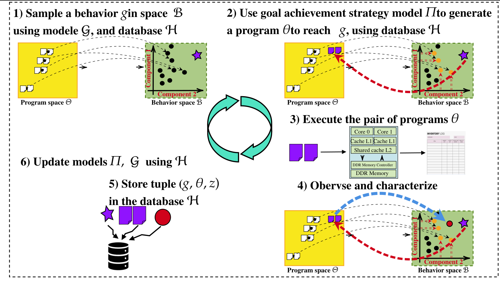

* The goal is to collect a diversity of interference behaviors when two independant programs are runing in paralle on both cores.
* This would help to understand what are the mechanisms that are responsible for interference.

## Environment
The environment describes the our complex systems by specifying its entries and outputs.
Interference events are among the following types:
* L2 cache interference
* DDR interference
* DDR controller interference
* Interconnect contention

To the aim of detecting interference, we synthesis a simulator that highlights any occuring interference event of these types.

Because a simulator can output multiple interfence events for one pair of input codes, we will collect multiple observations for each experience.
Throughout the exploration of the simulator, our autothelic agent targets combination of interference events involving the multiple interference types. For example, one can target both a DDR controller interference and an interconnect contention. Thus the goal achievement strategy model of IMGEP outputs a pair of programs that willpotentially exhibit these two type of interference.

## IMGEP 
The intrinsically motivated goal exploration process allows the use of knowledge on the output space of the complex systems to built candidate parameters that help increasing the discovery of the outputs in the output space.
For our system, we'll use this algorithm that can be illustrated as follow:

